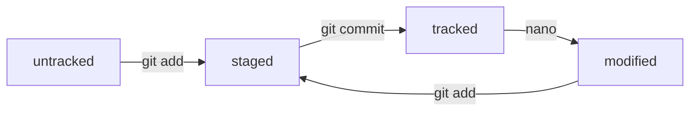

### Данный репозиторий создан с целью освоения git
---
Так же, добавимм немного магии markdown  

```python
def fn(a):
  print(a)
```

---

Список git тем:
- git log
- git status
- HEAD
- origin
- tracked/untracked


git log: выводит список коммитов в обратном порядке. У каждого коммита присутствует хэш, автор и дата. Флаг
-- oneline позволяет выводить в сокращенной форме.

git status: выводит список файлов, которые не отслеживаются либо отслеживаются и были изменены.

HEAD: ссылка на последний коммит в ветке. Выводится при вызове git status. В папке .git есть файл HEAD, в котором указан путь до другого файла __ref: refs/heads/master__. В этом файле хранится хэш последнего коммита.

origin: псевдоним к текущему git репозиторию. Позволяет связывать текущий репозиторий и удаленный - git remote add origin <ссылка на удаленный репозиторий>.

tracked/untracked: список состояний файлов для git. 
1) touch newfile.txt: untracked - файл не отслеживается 
2) git add newfile.txt: tracked + staged - файл отслеживается и готов к коммиту
3) git commit: tracked - файл отслеживается, но уже закоммичен (в git status уже не выводится)
4) nano newfile.txt: tracked + modified - файл отслеживается, но еще не готов для коммита




[ссылка на урок](https://practicum.yandex.ru/trainer/git-basics/lesson/c6b9607c-e8bc-4446-89f9-c74522c3492f/ 'Yandex practicum' )
